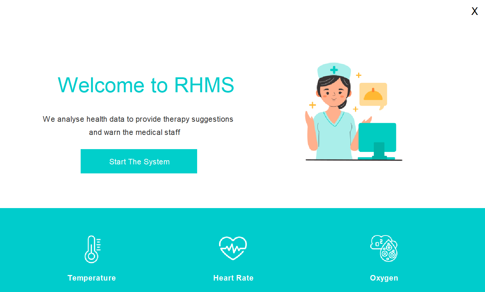
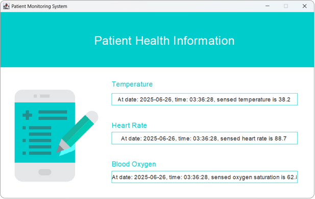
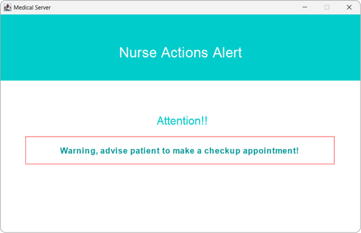
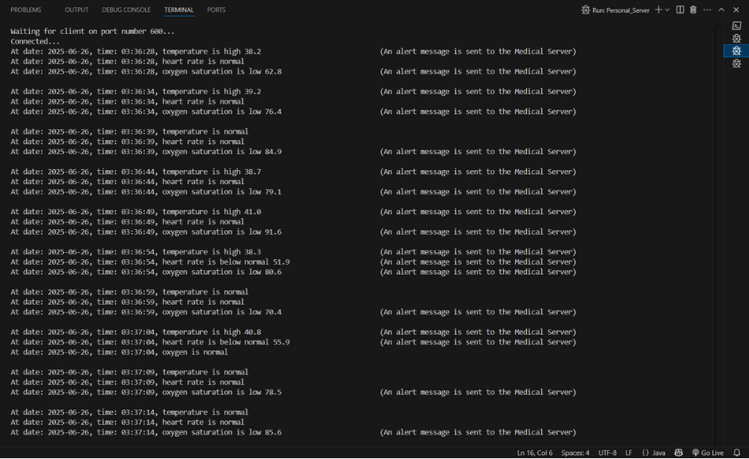

# 🫀 Remote Health Monitoring System
The Remote Health Monitoring System (RHMS) is a Java-based client-server application designed to monitor and manage patients' health data remotely. It simulates real-time data transmission between a patient device (client) and a central medical server.

By using classical TCP socket programming and a user-friendly Java Swing GUI, this system demonstrates how remote health tracking can be implemented effectively for chronic illness management and emergency response.

## 📈 Interaction Diagram

<div align="center">
  <picture>
    <source srcset="assets/interaction-diagram-dark.png" media="(prefers-color-scheme: dark)">
    <source srcset="assets/interaction-diagram-light.png" media="(prefers-color-scheme: light)">
    
  </picture>
</div>

## 🧠 System Architecture

The application follows a modular, client-server design:

- **Client (Sensor Device):** Simulates patient-side sensors and transmits data.
- **Personal Server:** Acts as the decision-maker, evaluating incoming data.
- **Medical Server:** Receives abnormal health readings and handles alerts/logs.

All components communicate using TCP sockets to ensure reliable, ordered data transfer.

## 📷 Screenshots

<div align="center">
  <table style="border: none;">
    <tr>
      <td align="center" style="border: none;">
        <br/>
        <sub><b>Figure 1:</b> Sensor Client Application Interface</sub>
      </td>
      <td align="center" style="border: none;">
        <br/>
        <sub><b>Figure 2:</b> Get Input Interface</sub>
      </td>
    </tr>
  </table>
</div>

<div align="center">
  <table style="border: none;">
    <tr>
      <td align="center" style="border: none;">
        <br/>
        <sub><b>Figure 3:</b> Patient Health Information Interface</sub>
      </td>
      <td align="center" style="border: none;">
        <br/>
        <sub><b>Figure 4:</b> Personal Server Interface</sub>
      </td>
      <td align="center" style="border: none;">
        <br/>
        <sub><b>Figure 5:</b> Medical Server Interface</sub>
      </td>
    </tr>
  </table>
</div>

<div align="center">
  <table style="border: none;">
    <tr>
      <td align="center" style="border: none;">
        <br/>
        <sub><b>Figure 6:</b> Sensor Client Application Terminal</sub>
      </td>
      <td align="center" style="border: none;">
        <br/>
        <sub><b>Figure 7:</b> Personal Server Terminal</sub>
      </td>
      <td align="center" style="border: none;">
        <br/>
        <sub><b>Figure 8:</b> Medical Server Terminal</sub>
      </td>
    </tr>
  </table>
</div>

## 📁 Project Structure

   ```bash
    remote-health-monitoring-system/
    ├── src/
    │   ├── icons/
    │   ├── medicalServer/
    │   │   ├── medicalServerGUI.java
    │   │   └── medicalServer.java
    │   ├── personalServer/
    │   │   ├── personalServerGUI.java
    │   │   └── personalServer.java
    │   └── sensorClientApp/
    │       ├── getInputGUI.java
    │       ├── patientHealthInfoGUI.java
    │       ├── sensorClientAppGUI.java
    │       └── sensorClientApp.java
    └── README.md
   ```

## 👨‍💻 Authors
- Reem Saleh Saeed Al Malki
- Asail Mashhour Al Amoudi
- Mayar Mohammed Al Swill
- Hadeel Abdullah Abuhamous
- Reema Raddad Al Malki
- Lujain Abdulaziz Al Sulami 